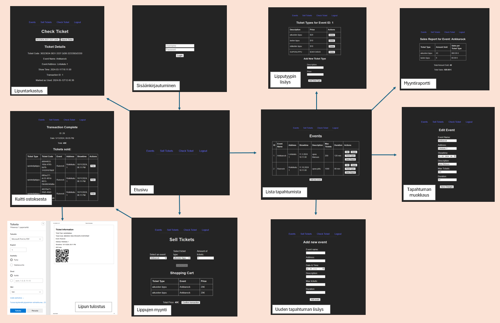

# TicketGuru

Tiimi: Heli Kyllinen, Viljami Olsen, Leevi Vehviläinen, Sakari Arasola, Viivi Salin

## Johdanto

-   Järjestelmä tehdään lipputoimistolle, joka myy lippuja lipunmyyntijärjestelmän avulla. Lipunmyyntitoimisto voi tarkastella myyntitapahtumia järjestelmän avulla.
-   Toteutus- ja toimintaympäristö lyhyesti:  
    -   Palvelinpuolen ratkaisut ja teknologiat (esim. palvelinteknologia, mikä tietokantajärjestelmä on käytössä)
- MariaDB / HeidiSQL
    -   Käyttöliittymäratkaisut ja teknologiat:
        - nettisivut 
    
## Järjestelmän määrittely

Määrittelyssä järjestelmää tarkastellaan käyttäjän näkökulmasta. Järjestelmän
toiminnot hahmotellaan käyttötapausten tai käyttäjätarinoiden kautta, ja kuvataan järjestelmän
käyttäjäryhmät.

#### Lipunmyyjä

- Myy lippuja lipunmyyntitoimistossa
- Tarvittavat toiminnot:
    - lipun tai useamman lipun myynti kerralla
    - lipun tarkastus
    - lipun merkitseminen käytetyksi

Käyttäjätarinat:
- Haluan myydä yhden tai useamman lipun tiettyyn tapahtumaan.
- Haluan tarkastaa lipun tapahtumapaikan ovella ja nähdä onko lippu käytetty vai käyttämätön.
- Haluan merkata lipun käytetyksi.

#### Asiakas
- Ostaa lippuja lipunmyyntitoimistossa ja osallistuu lipun oikeuttavaan tapahtumaan

Käyttäjätarinat:
- Haluan ostaa yhden tai useamman lipun tiettyyn tapahtumaan.
- Haluan käyttää lipun tapahtumassa ja lippu tarkastetaan ovella.

#### Järjestelmän ylläpitäjä

- Vastaa lipunmyyntisovelluksen ylläpidosta.
- Tarvittavat toiminnot:
    - Uuden tapahtuman lisääminen
    - Jo lisätyn tapahtuman muokkaaminen
    - Tapahtuman poistaminen
    - Käyttäjien hallinta

Käyttäjätarinat:
- Haluan luoda uuden tapahtuman.
- Haluan muokata tapahtumaa ja lisätä sen myytävien lippujen määrää.

## Käyttöliittymä

Tässä kuvattu käyttöliittymän navigointi kaaviona.

## Tietokanta

> ### _Selitykset_
> _Tässä on selitykset tietokannan taulujen tyypeille._
>
>  Tyyppi | Kuvaus
> ------ | ------ 
> PK | Pääavain
> FK |  Viiteavain
> "*" |  Pakollinen tieto
> AN | Autonumber/laskuri
> C/10 | Teksti/pituus
> N| Numero
> DATE | Päivämäärä
> DATETIME | Päivämäärä ja kellonaika
> TIME | kellonaika

> ### _Tapahtuma_
> _Tapahtuma-taulu sisältää tapahtuman tiedot. Jokaiselle tapahtumalle tehdään oma taulu._
>
> Kenttä | Tyyppi | Kuvaus
> ------ | ------ | ------
> tapahtuma_id | PK* AN | Tapahtuman idnumero
> tapahtuma | *C/100 |  Tapahtuman nimi
> katuosoite | *C/100 |  Katuosoite missä tapahtuma sijaitsee
> ajankohta | *DATETIME | Tapahtuman ajankohta
> kuvaus | *C/500 | Tarkempi kuvaus tapahtumasta
> lippumäärä | *N | Tapahtumaan myytävien lippujen lukumäärä
> kesto| TIME | Tapahtuman kesto tunteina/minuutteina

> ### _Ostotapahtuma_
> _Ostotapahtuma-taulu sisältää ostotapahtuman tiedot. Yhteen ostotapahtumaan voi sisältyä useampi lippuostos._
>
> Kenttä | Tyyppi | Kuvaus
> ------ | ------ | ------
> ostotapahtuma_id | PK* AN | Ostotapahtuman idnumero
> pvm | *DATE |  Ostotapahtuman päivämäärä
> summa | * DOUBLE | Ostotapahtuman lippujen yhteissumma
> lippu_id| FK* N | Ostetun lipun idnumero, viittaus [Lippu](#Lippu)-tauluun
> myyja_id| FK* N | Ostotapahtuman tehneen käyttäjän idnumero, viittaus [Käyttäjä](#Käyttäjä)-tauluun

> ### _Lippu_
> _Lippu-taulu sisältää ostetun lipun tiedot._
>
> Kenttä | Tyyppi | Kuvaus
> ------ | ------ | ------
> lippu_id | PK* AN | Lipun idnumero
> lipputyyppi_id| FK* N | Ostetun lipun lipputyypin idnumero, viittaus [Lipputyyppi](#Lipputyyppi)-tauluun

> ### _Lipputyyppi_
> _Lippu-taulu sisältää ostetun lipun tiedot._
>
> Kenttä | Tyyppi | Kuvaus
> ------ | ------ | ------
> lipputyyppi_id | PK* AN | Lipputyypin idnumero
> tapahtuma_id| FK* N | Tapahtumapaikan idnumero, viittaus [Tapahtuma](#Tapahtuma)-tauluun
> lipputyyppi | *C/30 | Selitys lipputyypistä, esimerkiksi aikuinen/lapsi/opiskelija tms.
> kuvaus | *C/100 | Tarkempi kuvaus lipputyypistä, esimerkiksi esteettömyys.
> hinta | *DOUBLE | Lipun hinta.

> ### _Käyttäjä_
> _Käyttäjä-taulu sisältää Käyttäjä tiedot. Käyttäjällä voi olla vain yksi Käyttäjä_id käytössä._
>
> Kenttä | Tyyppi | Kuvaus
> ------ | ------ | ------
> Käyttäjä_id | PK* AN | Käyttäjän idnumero
> Käyttäjänimi | *C/50 | Käyttäjänimi, jota käytetään sovelluksessa
> Salasana | *C/50 | Salasana, jolla kirjaudutaan sovellukseen
> Rooli | *C/50 | Rooli, jolla käyttäjä pääsee tarvitsemiinsa sovelluksen osiin.
> etunimi | *C/50 |  Käyttäjän etunimi
> sukunimi | *C/50 |  Käyttäjän sukunimi
> katuosoite | *C/100 |  Katuosoite missä käyttäjä asuu
> puhelinnro | *C/20 | Käyttäjän puhelinnumero
> email | C/100 | Käyttäjän sähköpostiosoite

## Tekninen kuvaus

### Frontend-komponentti

Frontend on tehty reactilla. Frontend kommunikoi backendin kanssa REST-rajapinnan kautta. Rest Api tulee Rahdin tietokantapalvelun kautta ja käyttöliittymä Vercel palvelun kautta.

### Backend-komponentti

Backend on tehty Spring Bootilla ja se ajetaan Rahdin kautta. Kommunikointi tehdään Rest-rajapinnan kautta. Tässä linkki: https://ohjelmistoprojekti1-ticketguru-kovas.rahtiapp.fi/.

### Tietokanta-komponentti

Käytössä on MariaDB tietokanta ja sitä käytetään Rahdin kautta.

## Testaus

- Automaattisesti luotu TicketGuruApplicationTests on niin sanottu savutesti, joka testaa lähteekö sovellus käyntiin.
- Junit-testit testaavat EventRepositoryTest.java luokassa löytääkö tapahtuman nimen perusteella ja palauttaako se silloin tapahtuman osoitteen. Lisäksi testataan uuden tapahtuman luonti ja tapahtuman poistaminen. 
- Integraatiotesti testaa EventControllerIntegrationTest-luokassa uuden tapahtuman luontia ja sitä, että löytyykö se sen jälkeen eventRepositorysta. 
- End-to-end testi testaa, että tickettypen luonti, haku ja poisto toimii kokonaisuudessaan. Testi käyttää mockmvc työkalua.

## Asennustiedot

Asenna MariaDB-tietokanta omalle tietokoneellesi MariaDB:n viralliselta verkkosivustolta (https://mariadb.org/download/). Lataa myös HeidiSQL ja luo tyhjä tietokanta.
Kloonaa viimeisin versio sovelluksesta https://github.com/viljaminion/Ohjelmistoprojekti1. 

## Käynnistys- ja käyttöohje

### Sovelluksen käyttö lokaalisti

Käynnistä ticketGuruClient npm run dev-käskyllä terminaalissa oikeassa kansiossa. Avaa linkki, niin sovellus aukeaa.

### Sovelluksen käyttö Rahdissa

Tästä linkistä pääsee sovellukseen: https://ticketguru-client.vercel.app/.
Ylläpitäjän käyttäjätunnus on Mikko ja salasana admin.
Myyjän käyttäjätunnus on Maija ja salasana user.
