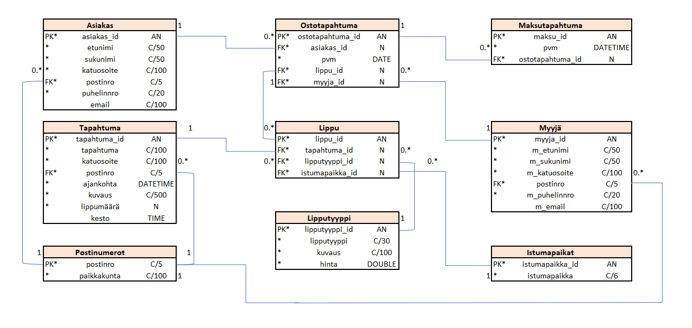

# TicketGuru (alustava nimi)

Tiimi: Heli Kyllinen, Viljami Olsen, Leevi Vehviläinen, Sakari Arasola, Viivi Salin

## Johdanto

-   Järjestelmä tehdään lipputoimistolle, joka myy lippuja lipunmyyntijärjestelmän avulla. Lipunmyyntitoimisto voi tarkastella myyntitapahtumia järjestelmän avulla.
-   Toteutus- ja toimintaympäristö lyhyesti:  
    -   Palvelinpuolen ratkaisut ja teknologiat (esim. palvelinteknologia, mikä tietokantajärjestelmä on käytössä)
- MariaDB / HeidiSQL
    -   Käyttöliittymäratkaisut ja teknologiat:
        - nettisivut 
    
## Järjestelmän määrittely

Määrittelyssä järjestelmää tarkastellaan käyttäjän näkökulmasta. Järjestelmän
toiminnot hahmotellaan käyttötapausten tai käyttäjätarinoiden kautta, ja kuvataan järjestelmän
käyttäjäryhmät.

-   Käyttäjäryhmiä ovat lipunmyyjät, asiakkaat (lipun ostajat), järjestelmän ylläpitäjä, lipunmyyntitoimiston johto
-   Käyttäjätarinat löytyy toisesta dokumentista
-   Lyhyt kuvaus käyttötapauksista tai käyttäjätarinat

Kuvauksissa kannattaa harkita, mikä on toteuttajalle ja asiakkaalle oleellista
tietoa ja keskittyä siihen.

## Käyttöliittymä

- Lipunmyyntisivu:
Tällä sivulla näkyy järjestelmän lippujen ja asiakkaiden tiedot, näiden välisenä siirtyämänä käytetään Ostotapahtuma-taulua.
- Tapahtumasivu:
Tällä sivulla näkyy tapahtumien ja tarkemmat lipputiedot.
- Tapahtumien hallinta: Tapahtumien CRUD-toiminnot (Rest)
- Myyntiraportti
Tällä sivulla näkyy maksutapahtumien tiedot.

## Tietokanta

> ### _Selitykset_
> _Tässä on selitykset tietokannan taulujen tyypeille._
>
>  Tyyppi | Kuvaus
> ------ | ------ 
> PK | Pääavain
> FK |  Viiteavain
> "*" |  Pakollinen tieto
> AN | Autonumber/laskuri
> C/10 | Teksti/pituus
> N| Numero
> DATE | Päivämäärä
> DATETIME | Päivämäärä ja kellonaika
> TIME | kellonaika

> ### _Asiakas_
> _Asiakas-taulu sisältää asiakkaan yhteystiedot. Asiakkaalla voi olla vain yksi asiakasid käytössä._
>
> Kenttä | Tyyppi | Kuvaus
> ------ | ------ | ------
> asiakas_id | PK* AN | Asiakkaan idnumero
> etunimi | *C(50) |  Asiakkaan etunimi
> sukunimi | *C(50) |  Asiakkaan sukunimi
> katuosoite | *C(100) |  Katuosoite missä asiakas asuu
> postinro | FK* C/5 | Postinumero, viittaus [Postinumerot](#Postinumerot)-tauluun
> puhelinnro | *C/20 | Asiakkaan puhelinnumero
> email | C/100 | Asiakkaan sähköpostiosoite

> ### _Tapahtuma_
> _Tapahtuma-taulu sisältää tapahtuman tiedot. Jokaiselle tapahtumalle tehdään oma taulu._
>
> Kenttä | Tyyppi | Kuvaus
> ------ | ------ | ------
> tapahtuma_id | PK* AN | Tapahtuman idnumero
> tapahtuma | *C(100) |  Tapahtuman nimi
> katuosoite | *C(100) |  Katuosoite missä tapahtuma sijaitsee
> postinro | FK* C/5 | Postinumero, viittaus [Postinumerot](#Postinumerot)-tauluun
> ajankohta | *DATETIME | Tapahtuman ajankohta
> kuvaus | *C/500 | Tarkempi kuvaus tapahtumasta
> lippumäärä | *N | Tapahtumaan myytävien lippujen lukumäärä
> kesto| TIME | Tapahtuman kesto tunteina/minuutteina

> ### _Postinumerot_
> _Postinumerot-taulu sisältää postinumerot._
>
> Kenttä | Tyyppi | Kuvaus
> ------ | ------ | ------
> postinro | PK* C/5 | Osoitteen postinumero, joka määrittää paikkakunnan.
> paikkakunta | *C(100) |  Paikkakunnan nimi

> ### _Ostotapahtuma_
> _Ostotapahtuma-taulu sisältää ostotapahtuman tiedot. Yhteen ostotapahtumaan voi sisältyä useampi lippuostos._
>
> Kenttä | Tyyppi | Kuvaus
> ------ | ------ | ------
> ostotapahtuma_id | PK* AN | Ostotapahtuman idnumero
> asiakas_id | FK* N | Asiakkaan idnumero, viittaus [Asiakas](#Asiakas)-tauluun
> pvm | *DATE |  Ostotapahtuman päivämäärä
> lippu_id| FK* N | Ostetun lipun idnumero, viittaus [Lippu](#Lippu)-tauluun
> myyja_id| FK* N | Ostotapahtuman tehneen myyjän idnumero, viittaus [Myyjä](#Myyjä)-tauluun

> ### _Lippu_
> _Lippu-taulu sisältää ostetun lipun tiedot._
>
> Kenttä | Tyyppi | Kuvaus
> ------ | ------ | ------
> lippu_id | PK* AN | Lipun idnumero
> tapahtuma_id | FK* N | Tapahtuman idnumero, viittaus [Tapahtuma](#Tapahtuma)-tauluun
> lipputyyppi_id| FK* N | Ostetun lipun lipputyypin idnumero, viittaus [Lipputyyppi](#Lipputyyppi)-tauluun
> istumapaikka_id| FK* N | Istumapaikan idnumero, viittaus [Istumapaikat](#Istumapaikat)-tauluun

> ### _Lipputyyppi_
> _Lippu-taulu sisältää ostetun lipun tiedot._
>
> Kenttä | Tyyppi | Kuvaus
> ------ | ------ | ------
> lipputyyppi_id | PK* AN | Lipputyypin idnumero
> lipputyyppi | *C/30 | Selitys lipputyypistä, esimerkiksi aikuinen/lapsi/opiskelija tms.
> kuvaus | *C/100 | Tarkempi kuvaus lipputyypistä, esimerkiksi esteettömyys.
> hinta | *DOUBLE | Lipun hinta.

> ### _Istumapaikat_
> _Istumapaikat-taulu sisältää ostetun lipun istumapaikan tiedot._
>
> Kenttä | Tyyppi | Kuvaus
> ------ | ------ | ------
> istumapaikka_id | PK* AN | Istumapaikan idnumero
>istumapaikka | *C/6 | Istumapaikan paikkanumero

> ### _Maksutapahtuma_
> _Maksutapahtuma-taulu sisältää maksutapahtuman tiedot. Yhteen ostotapahtumaan voi sisältyä useampi maksutapahtuma._
>
> Kenttä | Tyyppi | Kuvaus
> ------ | ------ | ------
> maksu_id | PK* AN | Maksutapahtuman idnumero
> pvm | *DATETIME |  Maksutapahtuman päivämäärä ja kellonaika
> ostotapahtuma_id | FK* N | Ostotapahtuman idnumero, viittaus [Ostotapahtuma](#Ostotapahtuma)-tauluun

> ### _Myyjä_
> _Myyjä-taulu sisältää myyjän yhteystiedot. Myyjällä voi olla vain yksi myyja_id käytössä._
>
> Kenttä | Tyyppi | Kuvaus
> ------ | ------ | ------
> myyja_id | PK* AN | Myyjän idnumero
> m_etunimi | *C(50) |  Myyjän etunimi
> m_sukunimi | *C(50) |  Myyjän sukunimi
> m_katuosoite | *C(100) |  Katuosoite missä myyjä asuu
> postinro | FK* C/5 | Postinumero, viittaus [Postinumerot](#Postinumerot)-tauluun
> m_puhelinnro | *C/20 | Myyjän puhelinnumero
> m_email | C/100 | Myyjän sähköpostiosoite

## Tekninen kuvaus

Teknisessä kuvauksessa esitetään järjestelmän toteutuksen suunnittelussa tehdyt tekniset
ratkaisut, esim.

-   Missä mikäkin järjestelmän komponentti ajetaan (tietokone, palvelinohjelma)
    ja komponenttien väliset yhteydet (vaikkapa tähän tyyliin:
    https://security.ufl.edu/it-workers/risk-assessment/creating-an-information-systemdata-flow-diagram/)
-   Palvelintoteutuksen yleiskuvaus: teknologiat, deployment-ratkaisut yms.
-   Keskeisten rajapintojen kuvaukset, esimerkit REST-rajapinta. Tarvittaessa voidaan rajapinnan käyttöä täsmentää
    UML-sekvenssikaavioilla.
-   Toteutuksen yleisiä ratkaisuja, esim. turvallisuus.

Tämän lisäksi

-   ohjelmakoodin tulee olla kommentoitua
-   luokkien, metodien ja muuttujien tulee olla kuvaavasti nimettyjä ja noudattaa
    johdonmukaisia nimeämiskäytäntöjä
-   ohjelmiston pitää olla organisoitu komponentteihin niin, että turhalta toistolta
    vältytään

## Testaus

Tässä kohdin selvitetään, miten ohjelmiston oikea toiminta varmistetaan
testaamalla projektin aikana: millaisia testauksia tehdään ja missä vaiheessa.
Testauksen tarkemmat sisällöt ja testisuoritusten tulosten raportit kirjataan
erillisiin dokumentteihin.

Tänne kirjataan myös lopuksi järjestelmän tunnetut ongelmat, joita ei ole korjattu.

## Asennustiedot

Järjestelmän asennus on syytä dokumentoida kahdesta näkökulmasta:

-   järjestelmän kehitysympäristö: miten järjestelmän kehitysympäristön saisi
    rakennettua johonkin toiseen koneeseen

-   järjestelmän asentaminen tuotantoympäristöön: miten järjestelmän saisi
    asennettua johonkin uuteen ympäristöön.

Asennusohjeesta tulisi ainakin käydä ilmi, miten käytettävä tietokanta ja
käyttäjät tulee ohjelmistoa asentaessa määritellä (käytettävä tietokanta,
käyttäjätunnus, salasana, tietokannan luonti yms.).

## Käynnistys- ja käyttöohje

Tyypillisesti tässä riittää kertoa ohjelman käynnistykseen tarvittava URL sekä
mahdolliset kirjautumiseen tarvittavat tunnukset. Jos järjestelmän
käynnistämiseen tai käyttöön liittyy joitain muita toimenpiteitä tai toimintajärjestykseen liittyviä asioita, nekin kerrotaan tässä yhteydessä.

Usko tai älä, tulet tarvitsemaan tätä itsekin, kun tauon jälkeen palaat
järjestelmän pariin !
